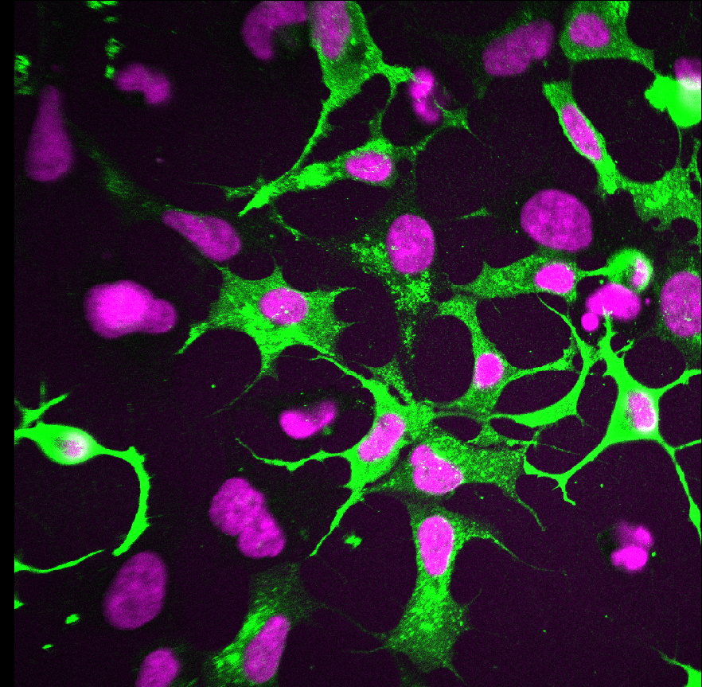
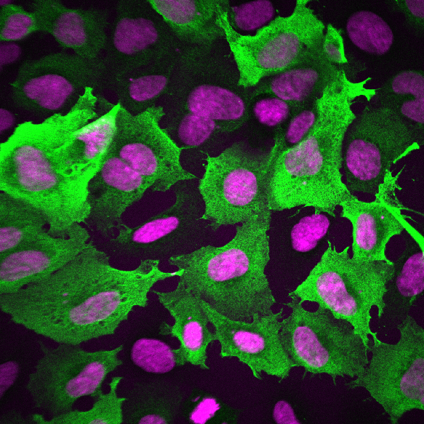
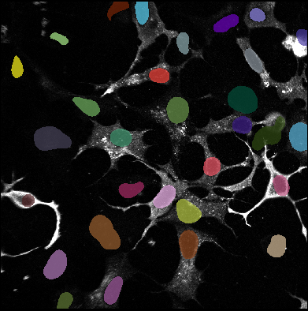
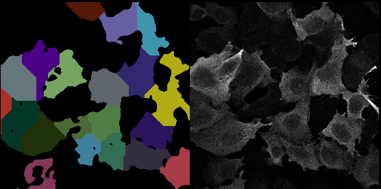
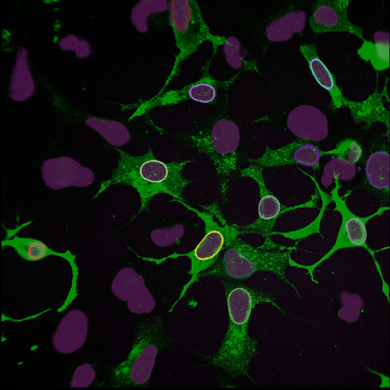
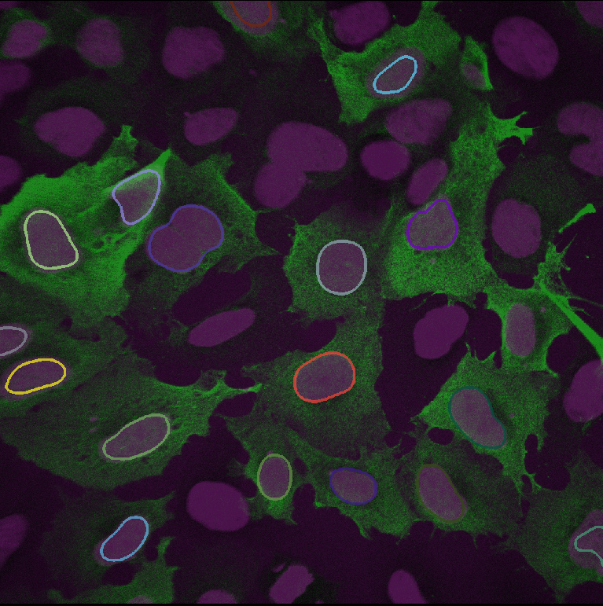

# Example_01
 
A set of scripts which use the napari plugin [napari-segment-blobs-and-things-with-membranes](https://github.com/haesleinhuepf/napari-segment-blobs-and-things-with-membranes) to segment nuclei and cells and then visualises the results in the napari viewer.
## Pre-requisites
- Create a new conda/mamba environment and install [devbio-napari](https://github.com/haesleinhuepf/devbio-napari#installation) using mamba (already on OnDemand).
```
- mamba create --name devbio-napari-env python=3.9 devbio-napari -c conda-forge -c pytorch
```

- Afterwards, activate the environment.
```
conda activate devbio-napari-env
```

Then navigate to the repo and run the desired scripts from the command line which should, hopefully, work.
## Data
 

Two channel datasets visualised in napari with enhanced contrast. 

## Nuceli Segmentation
Performs Voronoi-Otsu-Labelling, a workflow which combines Gaussian blur, spot detection, thresholding and binary watershed, to label nuclei as well as output the number of nuclei detected and their centroids. See [nsbatwm implementation](https://github.com/haesleinhuepf/napari-segment-blobs-and-things-with-membranes/blob/main/napari_segment_blobs_and_things_with_membranes/__init__.py)




## Local Maxima
Local maxima detection with [plyclesperanto-prototype's](https://github.com/clEsperanto/pyclesperanto_prototype) `detect_maxima_box` and li thresholding.

Clustering the points according to nearest neighbour with nuclei centroids as the origins of the clusters. 


## Protein Segmentation
Requires a nuclei marker such as DAPI. Similar to nuclei segmentation but uses a binary mask from the protein channel to perform watershed from nuclei centroids.



Outputs a summary .csv fie with number of nuclei detected, number of protein blobs detected and number of nuclei associated with a protein blob.
A labels layer will be produced identifying which, and how many, nuclei are within a protein blob with an outline around those nuclei.

 


## Using napari-skimage-regionprops
Running the `example_1_viewer.py` will open napari with a table measuring the properties of the `segmented_nuclei` layer using [regionprops](https://github.com/haesleinhuepf/napari-skimage-regionprops/tree/master). To interact with the labels and see which index corresponds to which region, activate `pick mode` and tick `show selected`.

## Using Your Own Data
As of right now, only works with two channcel .czi data with the nuclei in channel 1 and the protein in channel 2. Save the data in the `Data` folder then run the desired script.


